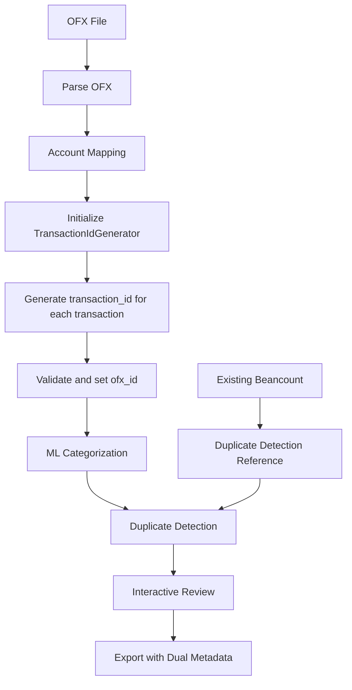
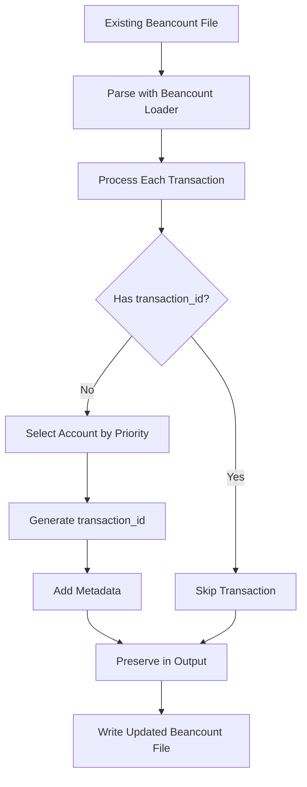
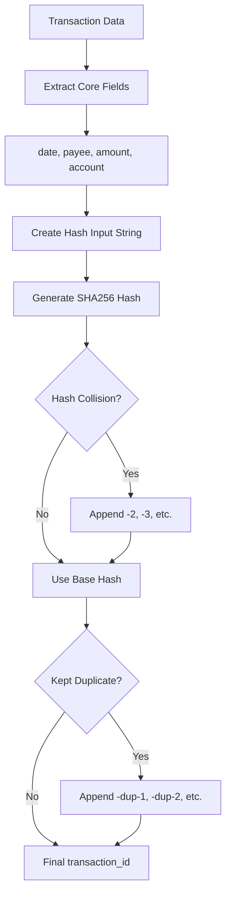

# Transaction ID Implementation Specification

**Version:** 1.0  
**Date:** 2025-01-12  
**Status:** Implemented

## Table of Contents

1. [Overview](#overview)
2. [Conceptual Design](#conceptual-design)
3. [Technical Implementation](#technical-implementation)
4. [Integration with Main Program](#integration-with-main-program)
5. [Utility Script Implementation](#utility-script-implementation)
6. [Data Flow and Architecture](#data-flow-and-architecture)
7. [Usage Examples](#usage-examples)
8. [Testing and Validation](#testing-and-validation)
9. [Troubleshooting](#troubleshooting)
10. [Future Considerations](#future-considerations)

## Overview

### Purpose

The Transaction ID system provides a robust, deterministic method for uniquely identifying financial transactions in Beancount files. This system serves multiple purposes:

1. **Unique Identification**: Each transaction gets a stable, reproducible identifier
2. **Duplicate Detection**: Enables reliable comparison with existing transactions
3. **Data Traceability**: Maintains audit trail from OFX source to final Beancount output
4. **Clean Output**: Separates identification metadata from human-readable transaction descriptions

### Key Benefits

- **Deterministic**: Same transaction data always produces same ID
- **Collision-Resistant**: Uses SHA256 cryptographic hashing
- **Self-Contained**: No external dependencies beyond Python standard library
- **Backward Compatible**: Works with existing Beancount workflows
- **Human Readable**: IDs are visible in Beancount metadata, not embedded in narration

## Conceptual Design

### Design Principles

#### 1. Deterministic Generation
Transaction IDs are generated using immutable transaction fields, ensuring the same transaction data always produces the same ID regardless of when or where it's processed.

#### 2. Collision Handling
The system handles the rare case of hash collisions by appending suffixes (`-2`, `-3`, etc.) to ensure uniqueness within a processing session.

#### 3. Duplicate Transaction Support
Special handling for kept duplicates using `-dup-1`, `-dup-2` suffixes to maintain uniqueness while preserving the relationship to the original transaction.

#### 4. Clean Separation of Concerns
Transaction identification is completely separate from human-readable descriptions, keeping narration fields clean and focused.

### Transaction ID Components

A transaction ID is generated from exactly four immutable fields:

```
Hash Input: "{date}|{payee}|{amount}|{account}"
```

**Example:**
```
Input: "2024-01-15|GROCERY STORE|-85.50|Liabilities:CreditCard"
Output: "a1b2c3d4e5f6789012345678901234567890123456789012345678901234567890"
```

#### Field Selection Rationale

1. **Date**: Transaction date in YYYY-MM-DD format
   - Immutable and always present
   - Provides temporal context
   
2. **Payee**: Merchant or transaction counterparty
   - Core identifying information
   - Handles empty/null payees gracefully
   
3. **Amount**: Transaction amount with currency
   - Critical differentiating factor
   - Includes sign (positive/negative)
   
4. **Account**: Mapped Beancount account name
   - Provides context about transaction source
   - Uses the confirmed/mapped account, not raw OFX account

### Dual Metadata System

The system maintains two types of metadata:

#### 1. Transaction ID (Always Present)
- **Field Name**: `transaction_id`
- **Source**: SHA256 hash of immutable transaction fields
- **Format**: 64-character hexadecimal string
- **Purpose**: Unique transaction identification

#### 2. OFX ID (Conditional)
- **Field Name**: `ofx_id`
- **Source**: Original transaction ID from OFX file
- **Format**: Variable string (as provided by financial institution)
- **Purpose**: Maintain reference to original OFX source
- **Inclusion**: Only when OFX ID is present and valid (non-empty, non-whitespace)

### Output Format Transformation

#### Before (Legacy Format)
```beancount
2024-01-15 * "GROCERY STORE" "Weekly shopping [ID: tx_001]"
  Expenses:Food:Groceries           85.50 USD
  Liabilities:CreditCard           -85.50 USD
```

#### After (New Metadata Format)  
```beancount
2024-01-15 * "GROCERY STORE" "Weekly shopping"
  transaction_id: "a1b2c3d4e5f6789012345678901234567890123456789012345678901234567890"
  ofx_id: "20240115001234567890"
  Expenses:Food:Groceries           85.50 USD
  Liabilities:CreditCard           -85.50 USD
```

## Technical Implementation

### Core Component: TransactionIdGenerator

**File**: `core/transaction_id_generator.py`

The `TransactionIdGenerator` class is designed as a self-contained, reusable component with zero external dependencies beyond Python's standard library.

#### Key Features

1. **Self-Contained Design**
   - No framework dependencies (FastAPI, Beancount, etc.)
   - Only uses standard library modules (`hashlib`, `secrets`, `typing`)
   - Easily portable to other projects

2. **Flexible Input Handling**
   - Accepts strings, Decimals, or floats for amounts
   - Gracefully handles None/empty values
   - Normalizes inputs for consistent hashing

3. **State Management**
   - Tracks used IDs to prevent duplicates within session
   - Maintains collision counters for suffix generation
   - Provides statistics and debugging information

#### Class Interface

```python
class TransactionIdGenerator:
    def __init__(self):
        """Initialize generator with empty state tracking."""
        
    def generate_id(self, date: str, payee: str, amount: Union[str, Decimal, float], 
                   mapped_account: str, is_kept_duplicate: bool = False) -> str:
        """Generate unique transaction ID using SHA256 hash."""
        
    def validate_ofx_id(self, ofx_id: Optional[str]) -> Optional[str]:
        """Validate and clean OFX transaction ID."""
        
    def reset(self):
        """Reset generator state."""
        
    def get_stats(self) -> Dict[str, int]:
        """Get generator statistics."""
```

#### Hash Generation Process

1. **Input Validation and Normalization**
   ```python
   clean_payee = str(payee) if payee else ""
   clean_amount = str(amount) if amount else "0"
   clean_account = str(mapped_account).strip()
   ```

2. **Hash Input Construction**
   ```python
   hash_input = f"{date}|{clean_payee}|{clean_amount}|{clean_account}"
   ```

3. **SHA256 Hash Generation**
   ```python
   base_hash = hashlib.sha256(hash_input.encode('utf-8')).hexdigest()
   ```

4. **Collision and Duplicate Handling**
   ```python
   if is_kept_duplicate:
       final_id = f"{base_hash}-dup-{counter}"
   elif base_hash in used_ids:
       final_id = f"{base_hash}-{collision_counter}"
   else:
       final_id = base_hash
   ```

#### Collision Handling Algorithm

```python
def _handle_collision(self, base_hash: str) -> str:
    """Handle hash collision with -N suffix."""
    if base_hash not in self.used_ids:
        return base_hash
    
    # Initialize counter if first collision
    if base_hash not in self.collision_counters:
        self.collision_counters[base_hash] = 1
    
    self.collision_counters[base_hash] += 1
    return f"{base_hash}-{self.collision_counters[base_hash]}"
```

#### Kept Duplicate Handling

```python
def _handle_kept_duplicate(self, base_hash: str) -> str:
    """Handle kept duplicate ID generation with -dup-N suffix."""
    dup_counter = 1
    while f"{base_hash}-dup-{dup_counter}" in self.used_ids:
        dup_counter += 1
    return f"{base_hash}-dup-{dup_counter}"
```

#### Fallback Mechanism

When the mapped account is unavailable, the generator uses a secure fallback:

```python
if not mapped_account or not str(mapped_account).strip():
    random_suffix = secrets.token_hex(4)  # 8 char random string
    fallback_id = f"fallback_{random_suffix}"
    return fallback_id
```

#### OFX ID Validation

```python
def validate_ofx_id(self, ofx_id: Optional[str]) -> Optional[str]:
    """Validate and clean OFX transaction ID."""
    if not ofx_id:
        return None
    
    cleaned = str(ofx_id).strip()
    if not cleaned or cleaned.isspace():
        return None
    
    return cleaned
```

#### Convenience Functions

For simple use cases that don't require state tracking:

```python
def generate_single_transaction_id(date: str, payee: str, amount: Union[str, Decimal, float], 
                                 mapped_account: str) -> str:
    """Generate a single transaction ID without state tracking."""
    generator = TransactionIdGenerator()
    return generator.generate_id(date, payee, amount, mapped_account)

def validate_single_ofx_id(ofx_id: Optional[str]) -> Optional[str]:
    """Validate a single OFX ID without instantiating generator."""
    generator = TransactionIdGenerator()
    return generator.validate_ofx_id(ofx_id)
```

#### Module Constants

```python
HASH_INPUT_FORMAT = "{date}|{payee}|{amount}|{account}"
FALLBACK_PREFIX = "fallback_"
DUPLICATE_SUFFIX_FORMAT = "-dup-{counter}"
COLLISION_SUFFIX_FORMAT = "-{counter}"
```

## Integration with Main Program

### Data Model Updates

#### Transaction Model Changes

**File**: `api/models/transaction.py`

```python
@dataclass  
class Transaction:
    """Represents a financial transaction with all associated data."""
    date: str  # ISO format YYYY-MM-DD
    payee: str
    memo: str
    amount: Decimal
    currency: str
    account: str  # Source account (from OFX)
    categorized_accounts: List[Posting]  # Target accounts
    narration: str  # User-entered note (clean, without ID)
    transaction_id: str  # NEW: SHA256 hash of immutable fields
    ofx_id: Optional[str]  # NEW: Original OFX transaction ID (when available)
    is_split: bool
    # DEPRECATED: Use ofx_id instead
    original_ofx_id: str
```

#### API Model Updates

```python
class TransactionAPI(BaseModel):
    """API model for transactions."""
    id: str = Field(..., description="Unique transaction identifier")
    date: str = Field(..., description="Transaction date in YYYY-MM-DD format")
    payee: str = Field(..., description="Transaction payee/merchant")
    memo: str = Field(..., description="Transaction memo/description")
    amount: Decimal = Field(..., description="Transaction amount")
    currency: str = Field(..., description="Currency code")
    suggested_category: Optional[str] = Field(None, description="ML suggested account category")
    confidence: Optional[float] = Field(None, description="ML confidence score (0.0-1.0)")
    is_potential_duplicate: bool = Field(False, description="Whether transaction might be a duplicate")
    duplicate_details: Optional['DuplicateMatch'] = Field(None, description="Details about potential duplicate match")
    narration: Optional[str] = Field("", description="User-entered narration (clean, without ID)")
    transaction_id: str = Field(..., description="SHA256 hash of immutable fields")  # NEW
    ofx_id: Optional[str] = Field(None, description="Original OFX transaction ID (when available)")  # NEW
    splits: Optional[List[PostingAPI]] = Field(None, description="Split postings if transaction is split")
```

### Beancount Output Generation

#### Updated Generator Logic

**File**: `core/beancount_generator.py`

The Beancount generator has been updated to output dual metadata instead of embedding IDs in narration:

```python
def generate_beancount_transaction(transaction: Transaction) -> str:
    """Generate a single Beancount transaction with dual metadata."""
    lines = []
    
    # Transaction header with clean narration
    combined_payee = _combine_payee_and_memo(transaction.payee, transaction.memo)
    header = f'{transaction.date} {flag} "{combined_payee}"'
    
    # Use narration field only for user-entered notes (clean, no ID embedding)
    if transaction.narration and transaction.narration.strip():
        header += f' "{transaction.narration}"'
    else:
        header += ' ""'
    
    lines.append(header)
    
    # Add dual metadata (transaction_id always, ofx_id conditionally)
    lines.append(f'  transaction_id: "{transaction.transaction_id}"')
    
    # Add ofx_id metadata only if available and valid
    if transaction.ofx_id:
        lines.append(f'  ofx_id: "{transaction.ofx_id}"')
    
    # Add postings...
    return "\n".join(lines) + "\n"
```

#### Key Changes from Legacy Format

1. **Clean Narration**: No more `[ID: xxx]` embedded in transaction descriptions
2. **Proper Metadata**: IDs are now in dedicated metadata fields with proper indentation
3. **Conditional OFX ID**: Only includes `ofx_id` metadata when a valid OFX ID exists
4. **Consistent Formatting**: 2-space indentation for all metadata fields

### Transaction Processing Pipeline Integration

#### ID Generation During Categorization

**File**: `api/routers/transactions.py`

Transaction IDs are generated during the `/transactions/categorize` API endpoint:

```python
@router.post("/categorize", response_model=TransactionCategorizeResponse)
async def categorize_transactions(request: TransactionCategorizeRequest):
    """Categorize all transactions using ML and detect duplicates."""
    
    # Initialize transaction ID generator for this session
    id_generator = TransactionIdGenerator()
    
    # Generate transaction IDs and validate OFX IDs for all transactions
    for transaction in session.transactions:
        # Generate SHA256-based transaction ID using mapped account
        transaction.transaction_id = id_generator.generate_id(
            date=transaction.date,
            payee=transaction.payee,
            amount=str(transaction.amount),
            mapped_account=request.confirmed_account,  # Use confirmed account for ID generation
            is_kept_duplicate=False  # Will handle kept duplicates later if needed
        )
        
        # Validate and set OFX ID from original_ofx_id
        transaction.ofx_id = id_generator.validate_ofx_id(transaction.original_ofx_id)
    
    # Continue with ML categorization...
```

#### Processing Flow

```
1. OFX File Parse → Raw Transactions
2. Account Mapping → Confirmed Account
3. ID Generation → transaction_id + ofx_id
4. ML Categorization → Suggested Categories
5. Duplicate Detection → Potential Duplicates
6. Interactive Review → User Confirmations
7. Export → Final Beancount Output
```

### Duplicate Detection Integration

#### Metadata Extraction for Reference

**File**: `core/duplicate_detector.py`

The duplicate detection system has been updated to extract metadata for reference purposes, while keeping the core duplicate detection logic completely unchanged:

```python
def extract_metadata_from_transaction(transaction_entry) -> dict:
    """
    Extract transaction_id and ofx_id metadata from Beancount transaction entry.
    
    NOTE: This metadata is extracted for reference purposes only.
    It is NOT used for duplicate detection logic.
    Duplicate detection continues to use date/payee/amount/account only.
    """
    metadata = {}
    
    # Check if transaction has meta attribute
    if hasattr(transaction_entry, 'meta') and transaction_entry.meta:
        # Extract transaction_id (for reference only, not duplicate detection)
        if 'transaction_id' in transaction_entry.meta:
            metadata['transaction_id'] = transaction_entry.meta['transaction_id']
        
        # Extract ofx_id (for reference only, not duplicate detection)  
        if 'ofx_id' in transaction_entry.meta:
            metadata['ofx_id'] = transaction_entry.meta['ofx_id']
    
    return metadata
```

**CRITICAL**: The duplicate detection algorithm itself remains completely unchanged:

```python
def _check_duplicate_match(new_txn: Transaction, existing_txn: Transaction) -> DuplicateMatch:
    """
    Check if two transactions are potential duplicates.
    
    Uses ONLY: date, account, amount, payee (fuzzy)
    Does NOT use: transaction_id, ofx_id, or any other metadata
    """
    match_criteria = []
    
    # Check date (exact match required)
    if new_txn.date == existing_txn.date:
        match_criteria.append("date")
    else:
        return None
    
    # Check source account (exact match required) 
    if new_txn.account == existing_txn.account:
        match_criteria.append("account")
    else:
        return None
    
    # Check amount (exact match required)
    if new_txn.amount == existing_txn.amount:
        match_criteria.append("amount")
    else:
        return None
    
    # Check payee similarity (fuzzy match > 90% required)
    payee_similarity = calculate_payee_similarity(new_txn.payee, existing_txn.payee)
    if payee_similarity > 0.9:
        match_criteria.append("payee")
        return DuplicateMatch(...)
    
    return None
```

## Utility Script Implementation

### Purpose and Design

**File**: `utils/add_transaction_ids.py`

The utility script provides a way to retroactively add transaction_id metadata to existing Beancount files that were created before the transaction ID system was implemented.

#### Key Design Principles

1. **Safety First**: Never overwrites existing files without explicit force flag
2. **Preserve Structure**: Maintains original file formatting and structure  
3. **Smart Processing**: Skips transactions that already have transaction_id metadata
4. **Comprehensive Reporting**: Provides detailed statistics and error reporting
5. **Code Reuse**: Leverages the same TransactionIdGenerator as the main program

### Account Selection Priority

The utility script uses a specific priority system to select which account and amount to use for transaction ID generation:

```python
def select_account_for_hash(txn: data.Transaction) -> Tuple[str, str]:
    """
    Select account and amount using priority logic.
    
    Priority order:
    1. Assets or Liabilities accounts (first found)
    2. Income accounts (first found) 
    3. First posting account
    """
    
    # Priority 1: Assets or Liabilities accounts
    for posting in txn.postings:
        if posting.account.startswith(('Assets:', 'Liabilities:')):
            if posting.units:
                amount_str = f"{posting.units.number} {posting.units.currency}"
                return posting.account, amount_str
    
    # Priority 2: Income accounts  
    for posting in txn.postings:
        if posting.account.startswith('Income:'):
            if posting.units:
                amount_str = f"{posting.units.number} {posting.units.currency}"
                return posting.account, amount_str
    
    # Priority 3: First posting with units
    for posting in txn.postings:
        if posting.units:
            amount_str = f"{posting.units.number} {posting.units.currency}"
            return posting.account, amount_str
    
    # Fallback: first posting even without units
    first_posting = txn.postings[0]
    amount_str = "0 USD"  # Default if no units
    return first_posting.account, amount_str
```

#### Rationale for Priority Order

1. **Assets/Liabilities First**: These typically represent the "source" of the transaction (bank account, credit card) and provide the most stable reference point
2. **Income Second**: Income accounts are usually well-defined and stable
3. **First Posting Fallback**: Ensures every transaction gets processed even if it doesn't fit standard patterns

### Transaction Processing Logic

```python
def process_transaction(txn: data.Transaction, verbose: bool = False) -> Tuple[data.Transaction, bool]:
    """Process individual transaction, return (modified_txn, was_modified)."""
    
    # Skip if transaction already has transaction_id metadata
    if has_transaction_id(txn):
        return txn, False
    
    try:
        # Select account and amount using priority logic
        account, amount_currency = select_account_for_hash(txn)
        
        # Generate transaction ID using same logic as main converter
        transaction_id = generate_single_transaction_id(
            date=txn.date.strftime('%Y-%m-%d'),
            payee=txn.payee or "",
            amount=amount_currency,
            mapped_account=account
        )
        
        # Add transaction_id metadata
        modified_txn = add_transaction_id_metadata(txn, transaction_id)
        
        return modified_txn, True
        
    except Exception as e:
        return txn, False
```

### Metadata Insertion

```python
def add_transaction_id_metadata(txn: data.Transaction, transaction_id: str) -> data.Transaction:
    """
    Add transaction_id as first metadata entry, preserving existing metadata.
    """
    # Start with existing metadata or empty dict
    new_meta = txn.meta.copy() if txn.meta else {}
    
    # Add transaction_id at beginning (will appear first when printed)
    # Create new dict with transaction_id first, then existing metadata
    updated_meta = {'transaction_id': transaction_id}
    updated_meta.update(new_meta)
    
    # Create new transaction with updated metadata
    return txn._replace(meta=updated_meta)
```

### File Processing Workflow

```python
def process_beancount_file(input_path: Path, output_path: Path, 
                          dry_run: bool = False, verbose: bool = False) -> Dict[str, int]:
    """Main file processing logic returning statistics."""
    
    # 1. Load and parse Beancount file
    entries, errors, options_map = loader.load_file(str(input_path))
    
    # 2. Process each entry
    processed_entries = []
    for entry in entries:
        if isinstance(entry, data.Transaction):
            processed_entry, was_modified = process_transaction(entry, verbose)
            processed_entries.append(processed_entry)
            # Update statistics...
        else:
            # Non-transaction entry, keep as-is
            processed_entries.append(entry)
    
    # 3. Write output file (if not dry run)
    if not dry_run:
        output_content = io.StringIO()
        printer.print_entries(processed_entries, file=output_content)
        
        with open(output_path, 'w', encoding='utf-8') as f:
            f.write(output_content.getvalue())
    
    return stats
```

### Command Line Interface

```bash
# Show help
python utils/add_transaction_ids.py --help

# Basic usage
python utils/add_transaction_ids.py -i input.beancount -o output.beancount

# Dry run to test without making changes
python utils/add_transaction_ids.py -i input.beancount -o output.beancount --dry-run

# Verbose output for debugging
python utils/add_transaction_ids.py -i input.beancount -o output.beancount --verbose

# Force overwrite existing output file (use with caution)
python utils/add_transaction_ids.py -i input.beancount -o output.beancount --force
```

### Error Handling and Safety

#### Exit Codes

```python
EXIT_SUCCESS = 0                # Successful completion
EXIT_FILE_ERROR = 1             # File access/permission errors
EXIT_PARSE_ERROR = 2            # Beancount parsing errors
EXIT_PROCESSING_ERROR = 3       # Processing/runtime errors
EXIT_ARGUMENT_ERROR = 4         # Command line argument errors
```

#### Safety Validations

1. **Input File Validation**
   - File exists and is readable
   - File is valid UTF-8 encoding
   - File can be parsed by Beancount

2. **Output File Safety**
   - Output file doesn't exist (unless `--force` used)
   - Parent directory exists or can be created
   - Output location is writable

3. **Processing Safety**
   - Skips transactions with existing transaction_id metadata
   - Preserves original file structure and formatting
   - Handles parsing errors gracefully

### Output and Reporting

#### Processing Statistics

```
============================================================
📊 PROCESSING SUMMARY
============================================================
Input file:  input.beancount
Output file: output.beancount

Total entries processed: 1,250
Transaction entries found: 156
Transactions with IDs added: 148
Transactions already had IDs: 8
Transactions skipped (errors): 0

Success rate: 100.0% of processable transactions
✅ Successfully added transaction_id metadata to 148 transactions!
============================================================
```

#### Verbose Output Sample

```
📖 Loading Beancount file: input.beancount
🔄 Processing 156 entries...
   ✅ Added ID to: 2024-01-16 GROCERY STORE
      Generated ID: 6988c307bbf5afcb... for account: Liabilities:CreditCard
   ⏭️  Skipped (has ID): 2024-01-17 GAS STATION
   ✅ Added ID to: 2024-01-18 COFFEE SHOP
      Generated ID: 83e53d29e4407ceb... for account: Assets:Checking
💾 Writing output file: output.beancount
```

## Data Flow and Architecture

### Main Program Flow



### Utility Script Flow



### ID Generation Flow



### Metadata Integration

```mermaid
graph TD
    A[Transaction Object] --> B[transaction_id Generation]
    A --> C[ofx_id Validation]
    B --> D[SHA256 Hash]
    C --> E{Valid OFX ID?}
    E -->|Yes| F[Clean and Store]
    E -->|No| G[Set to None]
    D --> H[Beancount Output]
    F --> H
    G --> H
    H --> I[transaction_id: "hash..."]
    H --> J[ofx_id: "original..." or omitted]
```

## Usage Examples

### Main Program Usage

#### 1. Basic OFX Processing with Transaction IDs

```bash
python ofx_converter.py \
  -i bank_statement.ofx \
  -o output.beancount \
  -c config.yaml \
  -l training.beancount \
  -a accounts.beancount
```

**Output:**
```beancount
; Generated by OFX to Beancount converter on 2024-01-15 14:30:15

2024-01-15 * "WHOLE FOODS MARKET" "Weekly groceries"
  transaction_id: "8f4691ea655affb472f248a2eeb3098062172e83d0a986d5bd3c9f5d19c7a1ae"
  ofx_id: "20240115001234567890"
  Expenses:Food:Groceries          127.45 USD
  Liabilities:Chase:SapphireReserve -127.45 USD

2024-01-16 * "SHELL GAS STATION" "Fuel"
  transaction_id: "f2a8e9c3b5d7f1a4e6c8b0d2f4a6e8c0b2d4f6a8e0c2f4a6e8c0b2d4f6a8e0c2"
  ofx_id: "20240116001234567891"
  Expenses:Transportation:Fuel      52.30 USD
  Liabilities:Chase:SapphireReserve -52.30 USD

2024-01-17 * "PAYROLL DEPOSIT" "Monthly salary"
  transaction_id: "d7f9a1c3e5b7d9f1a3c5e7b9d1f3a5c7e9b1d3f5a7c9e1b3d5f7a9c1e3b5d7f9"
  Assets:Chase:Checking            3250.00 USD
  Income:Salary                   -3250.00 USD
```

#### 2. Transaction with Split Categories

```beancount
2024-01-18 * "COSTCO WHOLESALE" "Bulk shopping trip"
  transaction_id: "a3c5e7b9d1f3a5c7e9b1d3f5a7c9e1b3d5f7a9c1e3b5d7f9a1c3e5b7d9f1a3c5"
  ofx_id: "20240118001234567892"
  Expenses:Food:Groceries          85.50 USD
  Expenses:Household:Supplies      42.30 USD
  Expenses:Personal:Clothing       67.20 USD
  Liabilities:Chase:SapphireReserve -195.00 USD
```

#### 3. Transaction without OFX ID

```beancount
2024-01-19 * "MANUAL ENTRY" "Cash transaction"
  transaction_id: "e5b7d9f1a3c5e7b9d1f3a5c7e9b1d3f5a7c9e1b3d5f7a9c1e3b5d7f9a1c3e5b7"
  Expenses:Food:Restaurant         25.00 USD
  Assets:Cash                     -25.00 USD
```

### Utility Script Usage

#### 1. Adding IDs to Existing File

**Input File (existing.beancount):**
```beancount
2024-01-15 * "Grocery Store" "Weekly shopping"
  Expenses:Food     85.50 USD
  Liabilities:CreditCard  -85.50 USD

2024-01-16 * "Gas Station" "Fuel"
  existing_meta: "some_value"
  Expenses:Transport  45.00 USD
  Liabilities:CreditCard  -45.00 USD
```

**Command:**
```bash
python utils/add_transaction_ids.py -i existing.beancount -o updated.beancount --verbose
```

**Output:**
```
📖 Loading Beancount file: existing.beancount
🔄 Processing 4 entries...
   ✅ Added ID to: 2024-01-15 Grocery Store
      Generated ID: 6988c307bbf5afcb... for account: Liabilities:CreditCard
   ✅ Added ID to: 2024-01-16 Gas Station
      Generated ID: 002e823fe6f34eec... for account: Liabilities:CreditCard
💾 Writing output file: updated.beancount

============================================================
📊 PROCESSING SUMMARY
============================================================
Input file:  existing.beancount
Output file: updated.beancount

Total entries processed: 4
Transaction entries found: 2
Transactions with IDs added: 2
Transactions already had IDs: 0
Transactions skipped (errors): 0

Success rate: 100.0% of processable transactions
✅ Successfully added transaction_id metadata to 2 transactions!
============================================================
```

**Output File (updated.beancount):**
```beancount
2024-01-15 * "Grocery Store" "Weekly shopping"
  transaction_id: "6988c307bbf5afcb63bc1bbdef4fb89b656d06c1cf9ac2a246720a15d0cc2335"
  Expenses:Food            85.50 USD
  Liabilities:CreditCard  -85.50 USD

2024-01-16 * "Gas Station" "Fuel"
  transaction_id: "002e823fe6f34eecbca25c07df856226a21f918821a7f734c00f29e7b74ffb69"
  existing_meta: "some_value"
  Expenses:Transport       45.00 USD
  Liabilities:CreditCard  -45.00 USD
```

#### 2. Dry Run Testing

```bash
python utils/add_transaction_ids.py -i large_file.beancount -o processed.beancount --dry-run
```

**Output:**
```
🔍 DRY RUN MODE - No files will be modified
📖 Loading Beancount file: large_file.beancount
🔄 Processing 1,250 entries...

============================================================
📊 PROCESSING SUMMARY
============================================================
Input file:  large_file.beancount
Output file: processed.beancount (NOT CREATED - dry run)

Total entries processed: 1,250
Transaction entries found: 156
Transactions with IDs added: 148
Transactions already had IDs: 8
Transactions skipped (errors): 0

Success rate: 100.0% of processable transactions
🔍 DRY RUN: Would add transaction_id metadata to 148 transactions
============================================================
```

#### 3. Processing Already-Processed File

```bash
python utils/add_transaction_ids.py -i updated.beancount -o double_processed.beancount --dry-run
```

**Output:**
```
🔍 DRY RUN MODE - No files will be modified
📖 Loading Beancount file: updated.beancount
🔄 Processing 4 entries...

============================================================
📊 PROCESSING SUMMARY
============================================================
Input file:  updated.beancount
Output file: double_processed.beancount (NOT CREATED - dry run)

Total entries processed: 4
Transaction entries found: 2
Transactions with IDs added: 0
Transactions already had IDs: 2
Transactions skipped (errors): 0

Success rate: 0.0% of processable transactions
🔍 DRY RUN: Would add transaction_id metadata to 0 transactions
============================================================
```

### API Usage Examples

#### Transaction Categorization with ID Generation

**Request:**
```json
POST /transactions/categorize
{
  "session_id": "uuid-string",
  "confirmed_account": "Liabilities:Chase:SapphireReserve",
  "confirmed_currency": "USD"
}
```

**Response:**
```json
{
  "transactions": [
    {
      "id": "8f4691ea655affb472f248a2eeb3098062172e83d0a986d5bd3c9f5d19c7a1ae",
      "date": "2024-01-15", 
      "payee": "GROCERY STORE",
      "memo": "FOOD PURCHASE",
      "amount": -85.50,
      "currency": "USD",
      "suggested_category": "Expenses:Food:Groceries",
      "confidence": 0.85,
      "narration": "",
      "transaction_id": "8f4691ea655affb472f248a2eeb3098062172e83d0a986d5bd3c9f5d19c7a1ae",
      "ofx_id": "20240115001234567890",
      "is_potential_duplicate": false
    }
  ],
  "total_count": 150,
  "high_confidence_count": 120,
  "duplicate_count": 3,
  "system_messages": []
}
```

#### Export with Dual Metadata Preview

**Response:**
```json
{
  "transactions_exported": 43,
  "file_path": "/path/to/output.beancount", 
  "summary": {
    "total_amount": 2500.75,
    "currency": "USD",
    "categories": {
      "Expenses:Food": 450.25,
      "Expenses:Transport": 125.50,
      "Expenses:Entertainment": 75.00
    },
    "date_range": {"start": "2024-01-01", "end": "2024-03-31"}
  },
  "beancount_preview": "2024-01-15 * \"GROCERY STORE FOOD PURCHASE\" \"Weekly grocery shopping\"\n  transaction_id: \"8f4691ea655affb472f248a2eeb3098062172e83d0a986d5bd3c9f5d19c7a1ae\"\n  ofx_id: \"20240115001234567890\"\n  Expenses:Food:Groceries           85.50 USD\n  Liabilities:Chase:SapphireReserve -85.50 USD\n\n...",
  "system_messages": []
}
```

## Testing and Validation

### Unit Testing Examples

#### TransactionIdGenerator Testing

```python
def test_deterministic_id_generation():
    """Test that same input always produces same ID."""
    generator = TransactionIdGenerator()
    
    id1 = generator.generate_id("2024-01-15", "GROCERY STORE", "-85.50", "Liabilities:CreditCard")
    id2 = generator.generate_id("2024-01-15", "GROCERY STORE", "-85.50", "Liabilities:CreditCard")
    
    # Should be different due to collision handling
    assert id1 != id2
    assert id2.endswith("-2")

def test_ofx_id_validation():
    """Test OFX ID validation and cleaning."""
    generator = TransactionIdGenerator()
    
    assert generator.validate_ofx_id("  123456  ") == "123456"
    assert generator.validate_ofx_id("") is None
    assert generator.validate_ofx_id(None) is None
    assert generator.validate_ofx_id("   ") is None

def test_fallback_id_generation():
    """Test fallback ID when account is missing."""
    generator = TransactionIdGenerator()
    
    id1 = generator.generate_id("2024-01-15", "GROCERY STORE", "-85.50", "")
    id2 = generator.generate_id("2024-01-15", "GROCERY STORE", "-85.50", None)
    
    assert id1.startswith("fallback_")
    assert id2.startswith("fallback_")
    assert id1 != id2  # Should be different random strings
```

#### Beancount Output Testing

```python
def test_dual_metadata_output():
    """Test that Beancount output includes dual metadata correctly."""
    transaction = create_test_transaction()
    transaction.transaction_id = "test_id_123"
    transaction.ofx_id = "ofx_456"
    
    output = generate_beancount_transaction(transaction)
    
    assert 'transaction_id: "test_id_123"' in output
    assert 'ofx_id: "ofx_456"' in output
    assert "[ID:" not in output  # No embedded IDs in narration

def test_conditional_ofx_id():
    """Test that ofx_id metadata is only included when valid."""
    transaction = create_test_transaction()
    transaction.transaction_id = "test_id_123"
    transaction.ofx_id = None
    
    output = generate_beancount_transaction(transaction)
    
    assert 'transaction_id: "test_id_123"' in output
    assert 'ofx_id:' not in output  # Should be omitted when None
```

### Integration Testing

#### End-to-End Testing

```python
def test_complete_ofx_processing():
    """Test complete OFX to Beancount conversion with transaction IDs."""
    # Process sample OFX file
    result = process_ofx_file("sample.ofx", "config.yaml")
    
    # Verify all transactions have IDs
    for transaction in result.transactions:
        assert transaction.transaction_id is not None
        assert len(transaction.transaction_id) == 64  # SHA256 hex length
        assert transaction.transaction_id.isalnum() or "-" in transaction.transaction_id
    
    # Verify Beancount output format
    beancount_output = generate_beancount_output(result.transactions)
    assert 'transaction_id:' in beancount_output
    assert '[ID:' not in beancount_output  # No legacy format

def test_utility_script_processing():
    """Test utility script adds IDs correctly."""
    # Create test input file
    create_test_beancount_file("input.beancount")
    
    # Run utility script
    result = run_utility_script("input.beancount", "output.beancount")
    
    # Verify output has transaction IDs
    output_content = read_file("output.beancount")
    assert 'transaction_id:' in output_content
    
    # Verify running again skips existing IDs
    result2 = run_utility_script("output.beancount", "output2.beancount", dry_run=True)
    assert result2.stats['transactions_with_existing_ids'] > 0
    assert result2.stats['transactions_processed'] == 0
```

### Performance Testing

#### Large File Processing

```python
def test_large_file_performance():
    """Test performance with large Beancount files."""
    # Create file with 10,000 transactions
    large_file = create_large_test_file(10000)
    
    start_time = time.time()
    result = run_utility_script(large_file, "output.beancount")
    end_time = time.time()
    
    processing_time = end_time - start_time
    transactions_per_second = 10000 / processing_time
    
    # Should process at least 100 transactions per second
    assert transactions_per_second > 100
    assert result.stats['transactions_processed'] == 10000
```

### Hash Collision Testing

```python
def test_hash_collision_handling():
    """Test that hash collisions are handled correctly."""
    generator = TransactionIdGenerator()
    
    # Generate same hash multiple times
    ids = []
    for i in range(5):
        id = generator.generate_id("2024-01-15", "TEST", "-100.00", "Assets:Test")
        ids.append(id)
    
    # Should have base hash and suffixes -2, -3, -4, -5
    base_hash = ids[0]
    assert ids[1] == f"{base_hash}-2"
    assert ids[2] == f"{base_hash}-3"
    assert ids[3] == f"{base_hash}-4"
    assert ids[4] == f"{base_hash}-5"
```

### Validation Testing

#### Data Integrity Validation

```python
def test_metadata_integrity():
    """Test that metadata is properly preserved and formatted."""
    original_transaction = create_test_transaction_with_metadata()
    
    # Process through utility script
    processed = process_transaction_with_utility(original_transaction)
    
    # Verify original metadata is preserved
    assert processed.meta['existing_field'] == original_transaction.meta['existing_field']
    
    # Verify transaction_id is added as first field
    meta_keys = list(processed.meta.keys())
    assert meta_keys[0] == 'transaction_id'
    
    # Verify transaction_id format
    assert len(processed.meta['transaction_id']) == 64
    assert all(c in '0123456789abcdef-' for c in processed.meta['transaction_id'])
```

## Troubleshooting

### Common Issues and Solutions

#### 1. Hash Collision Warnings

**Symptom**: Transaction IDs with `-2`, `-3` suffixes appearing frequently

**Cause**: Multiple transactions with identical hash inputs

**Analysis**:
```python
# Debug hash collisions
generator = TransactionIdGenerator()
hash_input, hash_output = generator.generate_hash_components(
    date="2024-01-15",
    payee="STORE",
    amount="-100.00",
    mapped_account="Assets:Checking"
)
print(f"Hash input: {hash_input}")
print(f"Hash output: {hash_output}")
```

**Solutions**:
1. Check for duplicate transactions in source data
2. Verify account mapping is working correctly
3. Review payee normalization logic

#### 2. Missing transaction_id Metadata

**Symptom**: Some transactions don't get transaction_id metadata in utility script

**Diagnostic Steps**:
```bash
# Run with verbose output
python utils/add_transaction_ids.py -i input.beancount -o output.beancount --verbose

# Check for processing errors
python utils/add_transaction_ids.py -i input.beancount -o output.beancount --dry-run
```

**Common Causes**:
1. Transaction has no postings
2. All postings lack units/amounts
3. Transaction already has transaction_id metadata

#### 3. Fallback IDs Being Generated

**Symptom**: Transaction IDs starting with `fallback_`

**Cause**: Mapped account is empty or None during ID generation

**Investigation**:
```python
# Check account mapping in main program
print(f"Confirmed account: {request.confirmed_account}")
print(f"Transaction account: {transaction.account}")

# For utility script, check account selection
account, amount = select_account_for_hash(transaction)
print(f"Selected account: {account}")
print(f"Selected amount: {amount}")
```

**Solutions**:
1. Verify account mapping configuration
2. Check OFX parsing for account information
3. Review account selection priority logic

#### 4. OFX ID Not Appearing in Output

**Symptom**: No `ofx_id` metadata in Beancount output

**Diagnostic**:
```python
# Check OFX ID validation
generator = TransactionIdGenerator()
cleaned_id = generator.validate_ofx_id(transaction.original_ofx_id)
print(f"Original OFX ID: '{transaction.original_ofx_id}'")
print(f"Cleaned OFX ID: '{cleaned_id}'")
```

**Common Causes**:
1. OFX file doesn't contain transaction IDs
2. OFX transaction IDs are empty or whitespace-only
3. OFX parsing not extracting IDs correctly

#### 5. Utility Script File Permission Errors

**Symptom**: `FILE_ERROR: Output file not writable`

**Solutions**:
```bash
# Check parent directory permissions
ls -la $(dirname /path/to/output.beancount)

# Create parent directories if needed
mkdir -p $(dirname /path/to/output.beancount)

# Check output file permissions if it exists
ls -la /path/to/output.beancount

# Use --force if intentionally overwriting
python utils/add_transaction_ids.py -i input.beancount -o output.beancount --force
```

#### 6. Inconsistent Hash Generation

**Symptom**: Same transaction data producing different IDs

**Investigation**:
```python
# Test deterministic generation
from core.transaction_id_generator import generate_single_transaction_id

id1 = generate_single_transaction_id("2024-01-15", "STORE", "-100.00", "Assets:Checking")
id2 = generate_single_transaction_id("2024-01-15", "STORE", "-100.00", "Assets:Checking")

print(f"ID1: {id1}")
print(f"ID2: {id2}")
print(f"Match: {id1 == id2}")
```

**Expected Result**: Both IDs should be identical

**If Different**: Check for state pollution or threading issues

### Performance Issues

#### 1. Slow Processing of Large Files

**Symptoms**: 
- Utility script takes very long time
- Memory usage grows significantly

**Optimization**:
```bash
# Process in smaller batches (manual approach)
head -n 1000 large_file.beancount > batch1.beancount
python utils/add_transaction_ids.py -i batch1.beancount -o batch1_processed.beancount

# Monitor memory usage
/usr/bin/time -v python utils/add_transaction_ids.py -i large_file.beancount -o output.beancount
```

#### 2. High Memory Usage

**Investigation**:
```python
# Check if generator state is being reset
generator = TransactionIdGenerator()
print(f"Initial stats: {generator.get_stats()}")

# Process transactions...

print(f"Final stats: {generator.get_stats()}")

# Reset if needed
generator.reset()
```

### Data Validation Issues

#### 1. Invalid Characters in Transaction IDs

**Symptom**: Transaction IDs containing invalid characters

**Validation**:
```python
import re

def validate_transaction_id(txn_id: str) -> bool:
    """Validate transaction ID format."""
    # Should be 64 hex chars, possibly with collision/duplicate suffixes
    pattern = r'^[0-9a-f]{64}(-\d+|-dup-\d+)?$|^fallback_[0-9a-f]{8}$'
    return bool(re.match(pattern, txn_id))

# Test with actual IDs
for txn in transactions:
    if not validate_transaction_id(txn.transaction_id):
        print(f"Invalid transaction ID: {txn.transaction_id}")
```

#### 2. Metadata Format Issues

**Symptom**: Beancount parsing errors due to metadata format

**Check Metadata Format**:
```python
# Verify proper indentation and quoting
expected_format = '  transaction_id: "64-char-hex-string"'
actual_line = '  transaction_id: "actual-id-here"'

# Check for common issues:
# - Missing quotes around ID
# - Wrong indentation (should be 2 spaces)
# - Invalid characters in ID
```

## Reusing the Transaction ID Generator in Other Projects

### Overview

The `TransactionIdGenerator` was designed as a completely self-contained, reusable component that can be easily integrated into other financial or data processing projects. This section provides a complete guide for extracting and using the transaction ID generator in external projects.

### Self-Contained Design Benefits

#### Zero External Dependencies
- **Standard Library Only**: Uses only `hashlib`, `secrets`, and `typing`
- **No Framework Dependencies**: No FastAPI, Beancount, Django, Flask, or other framework dependencies
- **No Database Dependencies**: No SQLAlchemy, MongoDB, or database-specific code
- **Pure Python**: Works with Python 3.6+ without any additional packages

#### Framework Agnostic
- **Web Frameworks**: Works with Flask, Django, FastAPI, Tornado, etc.
- **Desktop Applications**: Integrates with tkinter, PyQt, Kivy applications
- **Command Line Tools**: Perfect for CLI utilities and batch processing scripts
- **Data Processing**: Compatible with pandas, NumPy, and data science workflows
- **Testing**: Easy to mock and unit test without complex dependencies

### Extraction Guide

#### Method 1: Single File Copy (Recommended)

The simplest way to reuse the generator is to copy the single file:

```bash
# Copy the generator to your project
cp /path/to/ofx-to-beancount/core/transaction_id_generator.py /your/project/utils/

# Or rename to match your project structure
cp /path/to/ofx-to-beancount/core/transaction_id_generator.py /your/project/id_generator.py
```

**File Requirements**: Only `transaction_id_generator.py` is needed - no other files required.

#### Method 2: Git Submodule (For Ongoing Updates)

```bash
# Add as submodule to get updates
git submodule add https://github.com/your-org/ofx-to-beancount.git vendor/ofx-to-beancount

# Import from submodule
from vendor.ofx_to_beancount.core.transaction_id_generator import TransactionIdGenerator
```

#### Method 3: Package Installation (Future)

```bash
# Future capability - publish as standalone package
pip install transaction-id-generator

# Usage
from transaction_id_generator import TransactionIdGenerator
```

### Integration Examples

#### Example 1: E-commerce Order Processing

```python
#!/usr/bin/env python3
"""
E-commerce order ID generation using TransactionIdGenerator.
"""

from transaction_id_generator import TransactionIdGenerator
from datetime import datetime
from decimal import Decimal

class OrderProcessor:
    def __init__(self):
        self.id_generator = TransactionIdGenerator()
    
    def process_order(self, order_data):
        """Generate unique order ID based on order details."""
        
        # Extract order details
        order_date = order_data['date'].strftime('%Y-%m-%d')
        customer_email = order_data['customer_email']
        total_amount = f"{order_data['total_amount']} {order_data['currency']}"
        payment_method = order_data['payment_method']
        
        # Generate deterministic order ID
        order_id = self.id_generator.generate_id(
            date=order_date,
            payee=customer_email,
            amount=total_amount,
            mapped_account=payment_method
        )
        
        return {
            'order_id': order_id,
            'original_data': order_data,
            'processed_at': datetime.now()
        }

# Usage
processor = OrderProcessor()

order = {
    'date': datetime(2024, 1, 15),
    'customer_email': 'customer@example.com',
    'total_amount': Decimal('127.50'),
    'currency': 'USD',
    'payment_method': 'credit_card'
}

result = processor.process_order(order)
print(f"Order ID: {result['order_id']}")
```

#### Example 2: Financial Transaction Logging

```python
#!/usr/bin/env python3
"""
Financial transaction logging system with deterministic IDs.
"""

from transaction_id_generator import TransactionIdGenerator
import json
from pathlib import Path

class TransactionLogger:
    def __init__(self, log_file_path):
        self.log_file = Path(log_file_path)
        self.id_generator = TransactionIdGenerator()
    
    def log_transaction(self, date, description, amount, account_type):
        """Log transaction with unique, deterministic ID."""
        
        # Generate stable transaction ID
        transaction_id = self.id_generator.generate_id(
            date=date,
            payee=description,
            amount=str(amount),
            mapped_account=account_type
        )
        
        # Create log entry
        entry = {
            'transaction_id': transaction_id,
            'timestamp': date,
            'description': description,
            'amount': float(amount),
            'account_type': account_type,
            'checksum': self._calculate_checksum(date, description, amount, account_type)
        }
        
        # Append to log file
        with open(self.log_file, 'a') as f:
            f.write(json.dumps(entry) + '\n')
        
        return transaction_id
    
    def _calculate_checksum(self, date, description, amount, account_type):
        """Generate checksum for data integrity verification."""
        from transaction_id_generator import generate_single_transaction_id
        return generate_single_transaction_id(date, description, str(amount), account_type)[:8]

# Usage
logger = TransactionLogger('financial_log.jsonl')

# Log various transactions
logger.log_transaction('2024-01-15', 'Coffee Purchase', -4.50, 'expenses')
logger.log_transaction('2024-01-15', 'Salary Deposit', 3000.00, 'income')
```

#### Example 3: Inventory Tracking System

```python
#!/usr/bin/env python3
"""
Inventory movement tracking with stable IDs.
"""

from transaction_id_generator import TransactionIdGenerator
from dataclasses import dataclass
from typing import List, Optional

@dataclass
class InventoryMovement:
    date: str
    item_sku: str
    quantity_change: int
    warehouse: str
    movement_type: str  # 'purchase', 'sale', 'transfer', 'adjustment'
    movement_id: Optional[str] = None

class InventoryTracker:
    def __init__(self):
        self.id_generator = TransactionIdGenerator()
        self.movements: List[InventoryMovement] = []
    
    def record_movement(self, movement: InventoryMovement) -> str:
        """Record inventory movement with deterministic ID."""
        
        # Generate movement ID based on core attributes
        movement.movement_id = self.id_generator.generate_id(
            date=movement.date,
            payee=movement.item_sku,
            amount=str(movement.quantity_change),
            mapped_account=f"{movement.warehouse}:{movement.movement_type}"
        )
        
        # Store movement
        self.movements.append(movement)
        
        return movement.movement_id
    
    def find_movement(self, movement_id: str) -> Optional[InventoryMovement]:
        """Find movement by ID."""
        return next((m for m in self.movements if m.movement_id == movement_id), None)
    
    def get_item_history(self, item_sku: str) -> List[InventoryMovement]:
        """Get all movements for specific item."""
        return [m for m in self.movements if m.item_sku == item_sku]

# Usage
tracker = InventoryTracker()

# Record various inventory movements
purchase = InventoryMovement(
    date='2024-01-15',
    item_sku='WIDGET-001',
    quantity_change=100,
    warehouse='MAIN',
    movement_type='purchase'
)

movement_id = tracker.record_movement(purchase)
print(f"Purchase recorded with ID: {movement_id}")

# Sale
sale = InventoryMovement(
    date='2024-01-16',
    item_sku='WIDGET-001', 
    quantity_change=-5,
    warehouse='MAIN',
    movement_type='sale'
)

sale_id = tracker.record_movement(sale)
print(f"Sale recorded with ID: {sale_id}")

# Get item history
history = tracker.get_item_history('WIDGET-001')
print(f"Found {len(history)} movements for WIDGET-001")
```

#### Example 4: Data Deduplication System

```python
#!/usr/bin/env python3
"""
Data deduplication using deterministic IDs.
"""

from transaction_id_generator import TransactionIdGenerator
from typing import Dict, Any, List

class DataDeduplicator:
    def __init__(self):
        self.id_generator = TransactionIdGenerator()
        self.seen_records: Dict[str, Any] = {}
    
    def process_record(self, record: Dict[str, Any], key_fields: List[str]) -> Dict[str, Any]:
        """
        Process record and detect duplicates based on key fields.
        
        Args:
            record: Data record to process
            key_fields: Fields to use for duplicate detection
            
        Returns:
            Dictionary with record data and duplicate information
        """
        
        # Extract key field values
        key_values = []
        for field in key_fields:
            value = record.get(field, '')
            key_values.append(str(value))
        
        # Generate ID based on key fields
        record_id = self.id_generator.generate_id(
            date=key_values[0] if len(key_values) > 0 else '',
            payee=key_values[1] if len(key_values) > 1 else '',
            amount=key_values[2] if len(key_values) > 2 else '',
            mapped_account='|'.join(key_values[3:]) if len(key_values) > 3 else 'default'
        )
        
        # Check for duplicate
        is_duplicate = record_id in self.seen_records
        
        result = {
            'record_id': record_id,
            'is_duplicate': is_duplicate,
            'original_record': record
        }
        
        if is_duplicate:
            result['first_seen'] = self.seen_records[record_id]
            result['action'] = 'duplicate_detected'
        else:
            self.seen_records[record_id] = record
            result['action'] = 'new_record'
        
        return result

# Usage
deduplicator = DataDeduplicator()

# Define key fields for duplicate detection
key_fields = ['date', 'email', 'amount', 'transaction_type']

# Process records
records = [
    {'date': '2024-01-15', 'email': 'user@example.com', 'amount': 100.00, 'transaction_type': 'payment'},
    {'date': '2024-01-15', 'email': 'user@example.com', 'amount': 100.00, 'transaction_type': 'payment'},  # Duplicate
    {'date': '2024-01-16', 'email': 'user@example.com', 'amount': 50.00, 'transaction_type': 'payment'},   # Different
]

for record in records:
    result = deduplicator.process_record(record, key_fields)
    print(f"Record ID: {result['record_id'][:16]}... - {result['action']}")
```

### Configuration and Customization

#### Custom Hash Input Format

While the default format works for most use cases, you can customize the hash input:

```python
from transaction_id_generator import TransactionIdGenerator

class CustomIdGenerator(TransactionIdGenerator):
    def generate_id(self, date, entity, value, category, project_id=None, **kwargs):
        """Custom ID generation for project management system."""
        
        # Custom hash input format
        hash_input = f"{date}|{entity}|{value}|{category}"
        if project_id:
            hash_input += f"|{project_id}"
        
        # Use parent class hash generation
        import hashlib
        base_hash = hashlib.sha256(hash_input.encode('utf-8')).hexdigest()
        
        # Apply collision handling
        return self._handle_collision(base_hash)

# Usage
generator = CustomIdGenerator()
task_id = generator.generate_id(
    date='2024-01-15',
    entity='task',
    value='implement-feature',
    category='development',
    project_id='PROJECT-123'
)
```

#### Validation Integration

```python
from transaction_id_generator import TransactionIdGenerator
import re

class ValidatingIdGenerator(TransactionIdGenerator):
    def generate_id(self, date, payee, amount, mapped_account, **kwargs):
        """Generate ID with input validation."""
        
        # Validate inputs
        if not re.match(r'^\d{4}-\d{2}-\d{2}$', date):
            raise ValueError(f"Invalid date format: {date}")
        
        if not mapped_account or not mapped_account.strip():
            raise ValueError("Mapped account cannot be empty")
        
        # Call parent implementation
        return super().generate_id(date, payee, amount, mapped_account, **kwargs)

# Usage with validation
generator = ValidatingIdGenerator()
try:
    valid_id = generator.generate_id('2024-01-15', 'STORE', '100.00', 'category')
    print(f"Generated ID: {valid_id}")
except ValueError as e:
    print(f"Validation error: {e}")
```

### Testing in External Projects

#### Unit Testing Template

```python
#!/usr/bin/env python3
"""
Unit tests for TransactionIdGenerator in external project.
"""

import unittest
from your_project.transaction_id_generator import TransactionIdGenerator

class TestTransactionIdGenerator(unittest.TestCase):
    def setUp(self):
        self.generator = TransactionIdGenerator()
    
    def test_deterministic_generation(self):
        """Test that same inputs produce same output."""
        id1 = self.generator.generate_id('2024-01-15', 'TEST', '100.00', 'category')
        
        # Reset generator state
        self.generator.reset()
        
        id2 = self.generator.generate_id('2024-01-15', 'TEST', '100.00', 'category')
        
        self.assertEqual(id1, id2)
    
    def test_collision_handling(self):
        """Test collision handling with duplicate inputs."""
        id1 = self.generator.generate_id('2024-01-15', 'TEST', '100.00', 'category')
        id2 = self.generator.generate_id('2024-01-15', 'TEST', '100.00', 'category')
        
        self.assertNotEqual(id1, id2)
        self.assertTrue(id2.endswith('-2'))
    
    def test_fallback_generation(self):
        """Test fallback ID generation."""
        fallback_id = self.generator.generate_id('2024-01-15', 'TEST', '100.00', '')
        
        self.assertTrue(fallback_id.startswith('fallback_'))
        self.assertEqual(len(fallback_id), 17)  # 'fallback_' + 8 hex chars
    
    def test_custom_use_case(self):
        """Test generator with your specific use case."""
        # Adapt this test to your project's needs
        custom_id = self.generator.generate_id(
            date='2024-01-15',
            payee='your-entity',
            amount='your-value',
            mapped_account='your-category'
        )
        
        self.assertIsNotNone(custom_id)
        self.assertEqual(len(custom_id), 64)  # SHA256 hex length
        self.assertTrue(all(c in '0123456789abcdef' for c in custom_id))

if __name__ == '__main__':
    unittest.main()
```

#### Integration Testing

```python
#!/usr/bin/env python3
"""
Integration test with your project's data models.
"""

from your_project.models import YourDataModel
from your_project.transaction_id_generator import TransactionIdGenerator

def test_integration_with_models():
    """Test ID generator with actual project data models."""
    
    generator = TransactionIdGenerator()
    
    # Create sample data using your project's models
    sample_data = YourDataModel(
        date='2024-01-15',
        name='Sample Entity',
        value=100.00,
        category='test'
    )
    
    # Generate ID
    entity_id = generator.generate_id(
        date=sample_data.date,
        payee=sample_data.name,
        amount=str(sample_data.value),
        mapped_account=sample_data.category
    )
    
    # Store ID in model
    sample_data.unique_id = entity_id
    
    # Verify integration
    assert sample_data.unique_id is not None
    assert len(sample_data.unique_id) == 64
    
    print(f"✅ Integration test passed: {entity_id}")

if __name__ == '__main__':
    test_integration_with_models()
```

### Performance Considerations for External Projects

#### Memory Management

```python
from transaction_id_generator import TransactionIdGenerator

# For batch processing, reset generator state periodically
generator = TransactionIdGenerator()

for batch_num, data_batch in enumerate(large_dataset_batches):
    # Process batch
    for item in data_batch:
        item_id = generator.generate_id(item.date, item.name, str(item.value), item.category)
        item.unique_id = item_id
    
    # Reset generator state every 1000 items to manage memory
    if batch_num % 10 == 0:  # Every 10 batches
        stats = generator.get_stats()
        print(f"Batch {batch_num}: Generated {stats['total_ids_generated']} IDs")
        generator.reset()
```

#### Multi-threading Considerations

```python
import threading
from transaction_id_generator import TransactionIdGenerator

# Thread-local generators for thread safety
thread_local_data = threading.local()

def get_thread_generator():
    """Get thread-specific generator instance."""
    if not hasattr(thread_local_data, 'generator'):
        thread_local_data.generator = TransactionIdGenerator()
    return thread_local_data.generator

def process_item_threaded(item):
    """Process item in thread-safe manner."""
    generator = get_thread_generator()
    return generator.generate_id(item.date, item.name, str(item.value), item.category)

# Use with thread pool
from concurrent.futures import ThreadPoolExecutor

with ThreadPoolExecutor(max_workers=4) as executor:
    results = list(executor.map(process_item_threaded, data_items))
```

### Migration from Other ID Systems

#### Migrating from UUID-based Systems

```python
from transaction_id_generator import TransactionIdGenerator
import uuid

class UUIDToHashMigrator:
    def __init__(self):
        self.hash_generator = TransactionIdGenerator()
        self.migration_map = {}  # uuid -> hash_id mapping
    
    def migrate_record(self, record):
        """Migrate record from UUID to hash-based ID."""
        
        # Generate new hash-based ID
        new_id = self.hash_generator.generate_id(
            date=record['date'],
            payee=record['entity'],
            amount=str(record['value']),
            mapped_account=record['category']
        )
        
        # Store migration mapping
        old_uuid = record['uuid']
        self.migration_map[old_uuid] = new_id
        
        # Update record
        record['transaction_id'] = new_id
        record['legacy_uuid'] = old_uuid  # Keep for reference
        
        return record
    
    def get_migration_stats(self):
        """Get migration statistics."""
        return {
            'total_migrated': len(self.migration_map),
            'generator_stats': self.hash_generator.get_stats()
        }
```

### Deployment and Distribution

#### Packaging for Distribution

```python
# setup.py for standalone package
from setuptools import setup, find_packages

setup(
    name='your-project-id-generator',
    version='1.0.0',
    description='Transaction ID generator extracted from OFX-to-Beancount project',
    author='Your Organization',
    author_email='your-email@example.com',
    packages=find_packages(),
    py_modules=['transaction_id_generator'],
    python_requires='>=3.6',
    classifiers=[
        'Development Status :: 5 - Production/Stable',
        'Intended Audience :: Developers',
        'License :: OSI Approved :: MIT License',
        'Programming Language :: Python :: 3',
        'Programming Language :: Python :: 3.6',
        'Programming Language :: Python :: 3.7',
        'Programming Language :: Python :: 3.8',
        'Programming Language :: Python :: 3.9',
        'Programming Language :: Python :: 3.10',
    ],
    keywords='transaction id generation hash deterministic finance',
    project_urls={
        'Source': 'https://github.com/your-org/your-project',
        'Documentation': 'https://your-project-docs.readthedocs.io/',
    }
)
```

#### Docker Integration

```dockerfile
# Dockerfile example
FROM python:3.9-slim

WORKDIR /app

# Copy only the ID generator (single file dependency)
COPY transaction_id_generator.py /app/

# Copy your application
COPY your_app.py /app/
COPY requirements.txt /app/

RUN pip install -r requirements.txt

CMD ["python", "your_app.py"]
```

### License and Attribution

When reusing the TransactionIdGenerator in other projects:

#### Attribution Requirements

```python
"""
Transaction ID Generator

Originally developed for the OFX-to-Beancount project.
Source: https://github.com/your-org/ofx-to-beancount

This component is self-contained and reusable under the same license
as the parent project. See LICENSE file for details.

Modifications for [Your Project Name]:
- [List any modifications you made]
- [Date of modifications]
"""
```

#### License Compatibility

The transaction ID generator inherits the same license as the parent OFX-to-Beancount project. Ensure your project's license is compatible before integration.

### Support and Community

#### Getting Help

1. **Documentation**: This specification document
2. **Source Code**: Original implementation with comprehensive docstrings
3. **Issues**: Report integration issues to the parent project
4. **Examples**: Use the examples in this section as templates

#### Contributing Back

If you make improvements to the TransactionIdGenerator while using it in your project:

1. **Submit Pull Requests**: Contribute improvements back to the parent project
2. **Share Use Cases**: Document interesting use cases for future users
3. **Report Bugs**: Help improve the generator for all users

This comprehensive reuse guide ensures that other projects can successfully integrate and customize the TransactionIdGenerator for their specific needs while maintaining the benefits of deterministic, collision-resistant ID generation.

## Future Considerations

### Potential Enhancements

#### 1. Enhanced Hash Algorithm Support

**Current**: SHA256 only
**Future**: Configurable hash algorithms (SHA3, BLAKE2b)

```python
# Future API design
generator = TransactionIdGenerator(hash_algorithm='sha3-256')
```

#### 2. Collision Resistance Improvements

**Current**: Simple numeric suffixes
**Future**: Incorporate additional differentiating factors

```python
# Future enhancement: include transaction index or timestamp
def generate_enhanced_id(self, date, payee, amount, account, transaction_index=None):
    base_input = f"{date}|{payee}|{amount}|{account}"
    if transaction_index is not None:
        base_input += f"|{transaction_index}"
    return hashlib.sha256(base_input.encode()).hexdigest()
```

#### 3. Batch Processing Optimization

**Current**: Single-threaded processing
**Future**: Multi-threaded utility script for large files

```python
# Future capability
python utils/add_transaction_ids.py -i large_file.beancount -o output.beancount --threads 4
```

#### 4. Migration and Upgrade Support

**Future**: Tools for migrating from legacy ID formats

```python
# Future utility
python utils/migrate_legacy_ids.py -i legacy_file.beancount -o migrated.beancount
```

#### 5. ID Format Versioning

**Future**: Support for different ID format versions

```python
# Future metadata format
transaction_id_version: "1.0"
transaction_id: "64-char-hash"
```

### Backward Compatibility Strategy

#### Long-term Compatibility Plan

1. **Phase 1 (Current)**: Support both legacy format reading and new format writing
2. **Phase 2 (Future)**: Deprecation warnings for legacy format
3. **Phase 3 (Long-term)**: Legacy format support removal

#### Migration Support

```python
# Future migration utility design
class IDFormatMigrator:
    def migrate_legacy_format(self, input_file: str, output_file: str):
        """Migrate from [ID: xxx] format to metadata format."""
        
    def detect_format_version(self, file_path: str) -> str:
        """Detect which ID format is used in file."""
        
    def validate_migration(self, original: str, migrated: str) -> bool:
        """Validate that migration preserved all transaction IDs."""
```

### Performance Optimization Roadmap

#### Current Performance Characteristics

- **Small files** (< 100 transactions): < 1 second
- **Medium files** (100-1000 transactions): 1-5 seconds  
- **Large files** (1000-10000 transactions): 5-30 seconds
- **Memory usage**: Linear with file size

#### Optimization Opportunities

1. **Streaming Processing**: Process files without loading entirely into memory
2. **Parallel Processing**: Multi-threaded transaction processing
3. **Incremental Updates**: Only process new transactions in existing files
4. **Caching**: Cache frequently-used hash computations

### Integration Enhancements

#### API Improvements

```python
# Future API endpoints
GET /transactions/{transaction_id}/history     # Get transaction modification history
POST /transactions/bulk-id-generation          # Bulk ID generation for imports
PUT /transactions/{transaction_id}/regenerate  # Regenerate ID with new algorithm
```

#### CLI Enhancements

```bash
# Future CLI capabilities
python ofx_converter.py --id-algorithm sha3-256
python ofx_converter.py --preserve-legacy-ids
python ofx_converter.py --validate-id-uniqueness
```

### Monitoring and Analytics

#### Future Monitoring Capabilities

1. **ID Generation Statistics**: Track collision rates, algorithm performance
2. **Migration Metrics**: Monitor legacy format migration progress
3. **Validation Reports**: Automated ID format and uniqueness validation

#### Logging and Debugging

```python
# Future enhanced logging
import logging

logger = logging.getLogger('transaction_id')
logger.info(f"Generated ID {txn_id} for transaction {date} {payee}")
logger.warning(f"Hash collision detected, using suffix: {final_id}")
logger.debug(f"Hash input: {hash_input}")
```

---

This specification provides a comprehensive foundation for understanding and working with the transaction ID system. It serves as both documentation for current functionality and a roadmap for future enhancements.